# PT Nexus 用户操作手册

> 版本：v1.0　|　适用对象：PT Nexus 使用者　|　最后更新：2026-09-28

PT Nexus 是一套自托管的 PT 转种辅助工具：从你已做种的站点读取种子信息，自动解析影片参数、生成规范的发布信息，再把种子发布到你指定的其他站点。本手册按页面逐个说明界面元素与操作步骤。

**阅读约定**

| 标记   | 含义                                    |
| ---- | ------------------------------------- |
| 源站   | 你已经在做种、从中读取种子信息的站点                    |
| 目标站  | 你将要发布种子的站点                            |
| 下载器  | 本系统中配置的 qBittorrent / Transmission 实例 |
| 一种多站 | 同一个资源在不同站点的做种记录（页面：一种多站）              |
| 一站多种 | 同一个种子在多个站点的转种记录（页面：一站多种）              |

> ⚠️ 工具的定位是"辅助"：它无法保证 100% 准确。发布前务必核对预览信息，发布后及时核实站点上的种子信息。

---

## 1. 快速上手

### 1.1 登录

浏览器打开 PT Nexus 地址后进入登录页，输入用户名与密码。

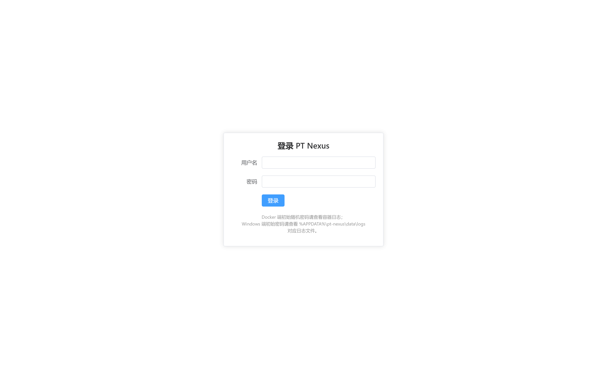

- **用户名 / 密码**：初始密码由系统生成，Docker 部署时查看容器日志。
- 在密码框中按回车可直接提交。
- 如果使用的是**临时密码**，登录后会提示「您正在使用临时密码，为了账户安全，请立即修改密码！」，并自动跳转到「设置 → 基础设置」的账户信息区，请先完成改密。

### 1.2 界面总览

登录后进入首页，顶部为全局导航栏，左侧是功能菜单，右侧是全局工具。

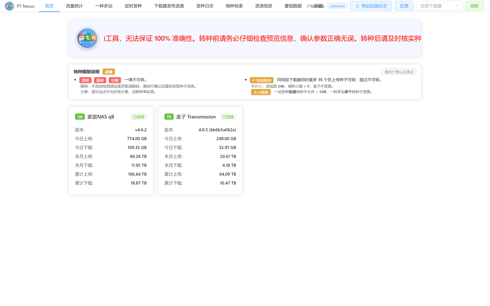

| 菜单      | 页面作用                  |
| ------- | --------------------- |
| 首页      | 风险提示与下载器实时概览          |
| 流量统计    | 上传/下载速率与数据量曲线         |
| 一种多站    | 按资源维度查看多站做种情况并发起转种    |
| 定时发种    | 按设定间隔逐个种子自动发布         |
| 自动发种    | 按 RSS 规则自动拉取、推送、整理、发布 |
| 下载器发布进度 | 查看发布队列任务的执行进度并手动干预    |
| 发种日志    | 查询历史发种结果与详细日志         |
| 做种检索    | 做种站点/官组统计与本地文件扫描      |
| 资源信息    | 影片资源信息库（标题、年份、海报、简介等） |
| 番组数据    | Bangumi 番组条目查询        |
| 设置      | 账户、下载器、站点等配置          |

顶部右侧的全局工具：

- **GitHub**：打开项目仓库。
- **版本号**：点击查看版本更新说明。
- **导出后端日志**：下载最近 24 小时日志，排查问题时可直接发给维护者。
- **全部下载器**：全局下载器筛选（详见 1.3）。
- **刷新**：刷新当前页面的缓存数据。仅在「一种多站」「一站多种」「做种检索」「自动发种」「发种日志」等页面可用；其他页面点击会提示「当前页面不支持刷新操作。」。

> 💡 在窄屏/手机上，顶部会收起为「刷新 + 菜单」两个按钮，点「菜单」打开侧边抽屉访问全部入口。

### 1.3 顶部全局下载器：全站筛选的唯一入口

导航栏右侧的下载器下拉框（默认显示「全部下载器」）控制**整个应用**的下载器范围。

- 选择某个下载器后，各页面的列表、统计、刷新范围都会收窄到该下载器。
- 选择后再进入任何页面，页面内不再提供下载器筛选入口，一律跟随顶部选择。
- 下拉框中只列出**已启用**的下载器。
-

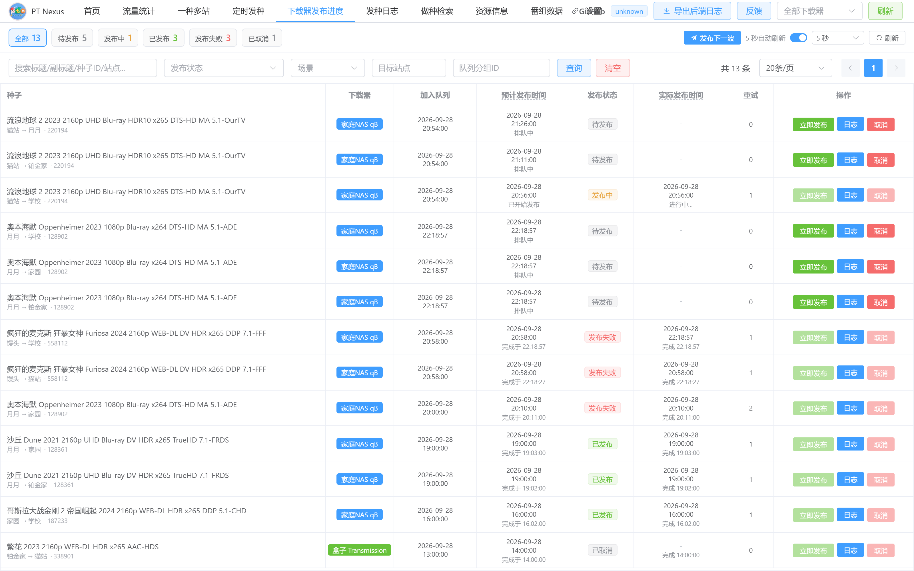

### 1.4 建议的首次使用顺序

1. 「设置 → 基础设置」修改用户名与密码；
2. 「设置 → 下载器」添加你的 qBittorrent / Transmission；
3. 「设置 → 站点管理」为源站配置 Cookie，为目标站确认「可发种」；
4. 到「一种多站」点「获取数据」，从下载器同步种子；
5. 选中种子 → 「转种」，按四步流程发布。

---

## 2. 首页

首页用于快速掌握下载器状态，并强调转种规则。

**页面构成**

1. **顶部滚动提示**：提醒本工具仅作转种辅助，需自行核对。
2. **转种限制说明（必读）**：
   - **禁转 / 限转 / 分集 一律不可转。**
   - **限转**：不自动检测源站是否取消限转，需自行确认后重新获取种子信息。
   - **分集**：部分站点不允许转分集，且断种率较高。
   - **IP 网段限制**：同网段下载器同时最多 15 个在上传种子可转；超过不可转。不计入：添加超 24h、做种人数 > 5；盒子不受限。
   - **大小限制**：一站多种批量转种不允许 < 1GB；一种多站单个转种不受限。
3. **下载器卡片**：每个已启用下载器一张卡片，每 30 秒自动刷新。
   - 卡片头部：类型标签（QB / TR）、下载器名称、连接状态（绿色「已连接」/ 红色「连接失败」）。
   - 明细字段：版本、今日上传、今日下载、本月上传、本月下载、累计上传、累计下载。
   - 下载器被禁用时显示「下载器已禁用」；没有配置下载器时显示「暂无下载器配置」。
   - 若提示「无法从服务器获取下载器信息」，说明后端访问下载器失败，请到「设置 → 下载器」点「测试」检查。

---

## 3. 流量统计

用曲线和柱状图展示各下载器的上传/下载速率与数据量。

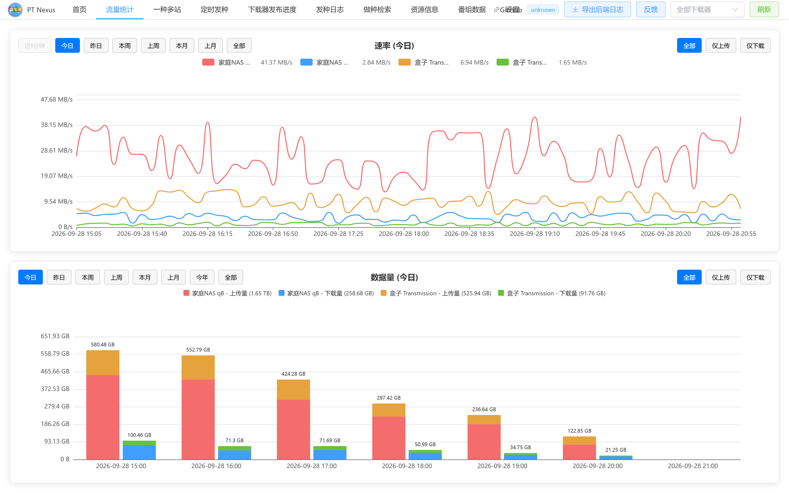

**上半部分：速率图**

- 时段按钮：`近1分钟`、`今日`、`昨日`、`本周`、`上周`、`本月`、`上月`、`全部`。
- 显示切换：`全部` / `仅上传` / `仅下载`。
- 点击图例中的下载器名称，可单独开关某条曲线。

> `近1分钟` 需要先在「设置 → 下载器」打开「开启实时速率」（每秒采集一次）；未开启时按钮为灰色，提示「请在设置页面开启"实时速率"以使用此功能」。

**下半部分：数据量图**

- 时段按钮：`今日`、`昨日`、`本周`、`上周`、`本月`、`上月`、`今年`、`全部`。
- 同样支持 `全部` / `仅上传` / `仅下载` 切换。

---

## 4. 一种多站

**页面作用**：按"资源"维度，查看一个资源在你的多个站点上的做种情况，并从这里把它转种（发布）到其他站点。

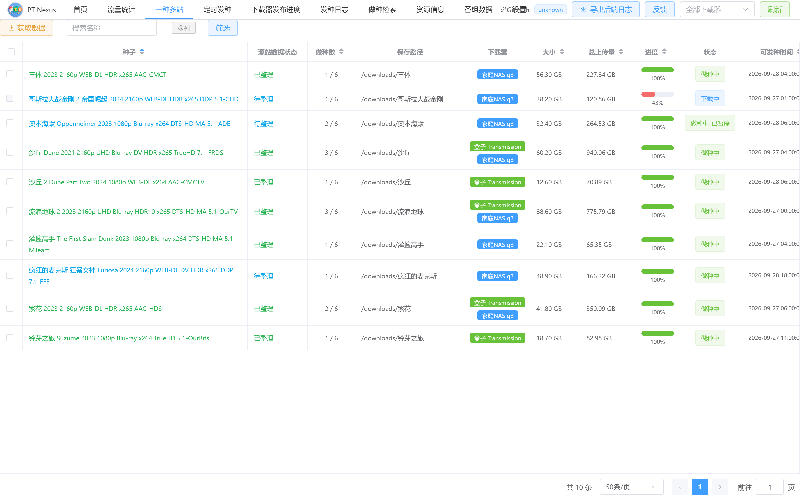

### 4.1 工具栏

| 控件    | 说明                            |
| ----- | ----------------------------- |
| 获取数据  | 打开「批量获取种子数据」面板，从下载器批量拉取种子信息   |
| 搜索名称… | 按种子名称过滤，回车生效                  |
| 列     | 控制显示哪些列                       |
| 筛选    | 打开筛选选项弹窗，按站点、保存路径、状态、源站数据状态过滤 |

### 4.2 表格列

- **种子**：资源名称（同一行代表同一资源）。
- **源站数据状态**：`未获取` / `待整理` / `已整理`（对应是否已抓取并核对过种子参数）。
- **做种数**：`当前做种站点数 / 总站点数`。
- **保存路径**、**下载器**、**大小**、**总上传量**、**进度**、**状态**。
- **可发种时间**：点击单元格可设置（单位：小时）。
- **最后发种时间**：未发种显示「未发种」。
- **可转种**：显示该资源的可转站数量。
- **操作**：`转种`、`删除`。

> 展开行（点击行首箭头）可以看到该资源在每个站点的标签；状态为「部分做种」表示进度未满；状态标签颜色：下载中为蓝、做种中为绿、暂停为黄、错误/丢失为红。

### 4.3 筛选

点「筛选」打开筛选选项弹窗，可组合以下条件：

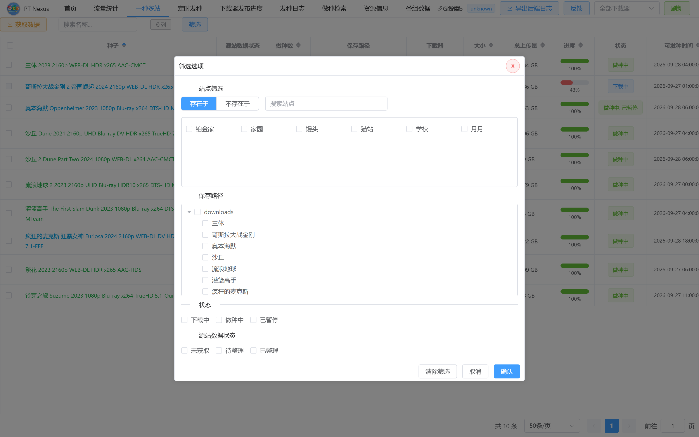

- **站点筛选**：`存在于` / `不存在于` + 站点多选；
- **保存路径**：按路径树勾选；
- **状态**：多选；
- **源站数据状态**：多选。

底部按钮：`清除筛选` / `取消` / `确认`。应用后工具栏会出现筛选条件标签，点「清除」可一键还原。

### 4.4 转种（核心操作）

**第 1 步：点击某一行的「转种」。**

如果该资源在多个站点做种，会先弹出源站点选择框：

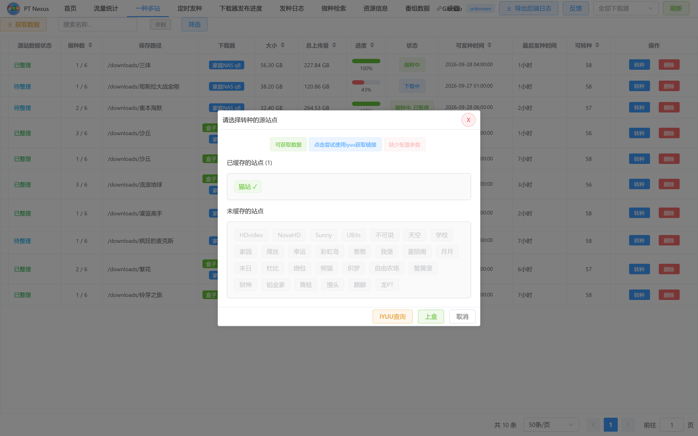

- `已缓存的站点`：已抓取过种子信息的站点，可直接使用（点击站点名进入下一步）。
- `未缓存的站点`：尚未抓取信息的站点，可通过 `IYUU查询` 尝试获取链接，或点 `上盒` 从盒子下载种子。
- 图例：`可获取数据`、`点击尝试使用iyuu获取链接`、`缺少配置参数`。

**第 2 步：核对种子详情。**

进入转种面板，顶部是四步流程：`核对种子详情` → `发布参数预览` → `选择发布站点` → `完成发布`。

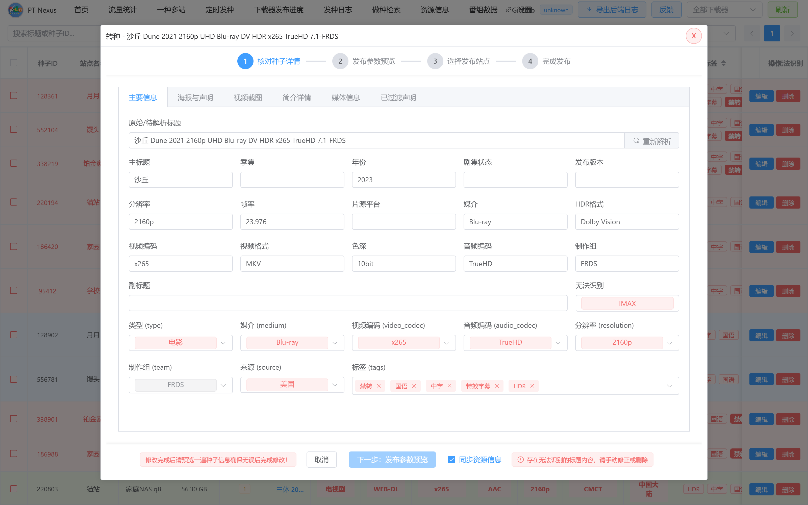

- 页签：`主要信息`、`海报与声明`、`视频截图`、`简介详情`、`媒体信息`、`已过滤声明`。
- 「主要信息」中可直接修改类型、媒介、视频编码、音频编码、分辨率、制作组、来源、标签等下拉项；点右侧「重新解析」可按标题重新推断参数。
- 底部按钮：`取消`、`下一步：发布参数预览`；勾选「同步资源信息」可同时把影片信息写入资源信息库。

> 若底部出现红字提示（例如「存在无法识别的标题内容，请手动修正或删除」），说明当前参数还过不了校验，「下一步」按钮为不可点状态。按提示逐项修正后按钮会自动变为可用。常见校验项：无法识别字段、年份为空、海报/截图/简介正文为空、简介缺少片名/产地/简介标记、类型/媒介/编码/分辨率/制作组为空、MediaInfo 格式无效。

**第 3 步：发布参数预览。**

在这一步逐项浏览将要提交的内容：主标题、副标题、资源信息（标题/年份/国家/豆瓣/IMDb/TMDb/简介/视频截图）、参数信息（各类外链、标签、类型、媒介、编码、分辨率、制作组、产地）、MediaInfo、简介内容（声明 + 海报 + 正文 + 截图）。确认无误后点「下一步：选择发布站点」。

**第 4 步：选择发布站点并发布。**

在「请选择要发布的目标站点」界面：

- 勾选目标站点，或点「全选」/「清空」；
- 开关项：`目标站点已存在时是否添加到下载器`、`目标站点已存在时是否更新种子信息`；
- **发种间隔时间**：填 `0` 表示沿用「设置 → 下载器」中该下载器的发布节奏；填大于 0 表示本次发布按此间隔错峰，每 N 分钟发一波，每波发几个站仍取该下载器的「并发数」；
- 最后点 `加入队列`（后台按节奏排队发布）或 `立即发布`（马上开始）。

### 4.5 站点数据与站点操作

点击行首展开中的站点标签，可以查看该站点的做种数据，并对缺失的详情页链接进行补录：

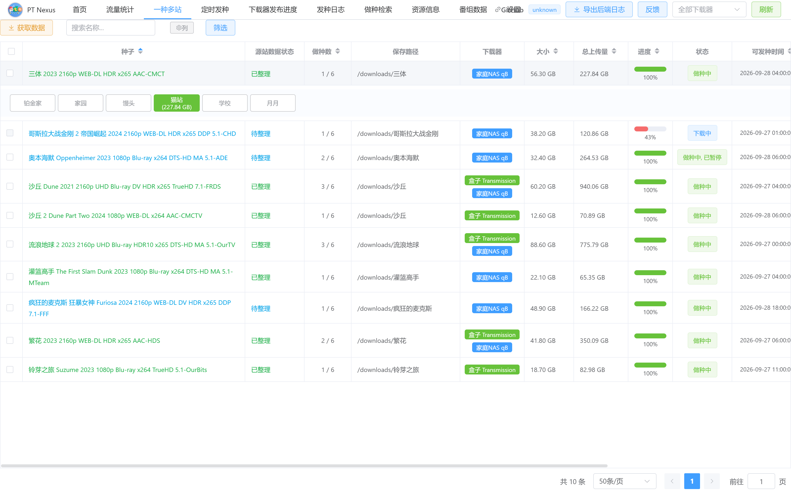

- 显示种子名称、站点名称、当前状态。
- 已有详情页链接时可直接点开，或点「设为不存在」标记。
- 没有链接时可输入完整链接（如 `https://example.com/details.php?id=123`）或纯数字 ID，点「添加链接」。

### 4.6 批量获取种子数据

点工具栏的「获取数据」打开批量获取面板，用于首次使用或数据过期时从下载器重新同步种子。

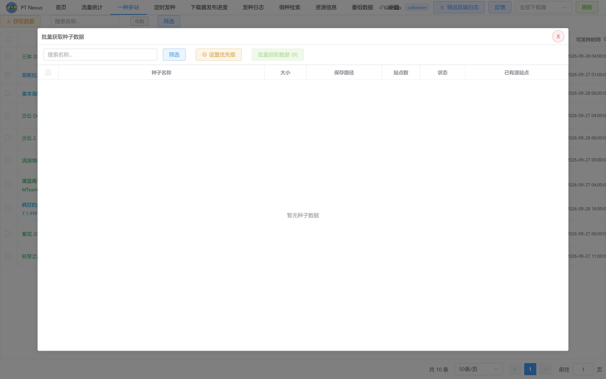

### 4.7 批量发种

勾选多行（仅进度 100% 的种子可勾选）后，页面底部出现批量操作栏：

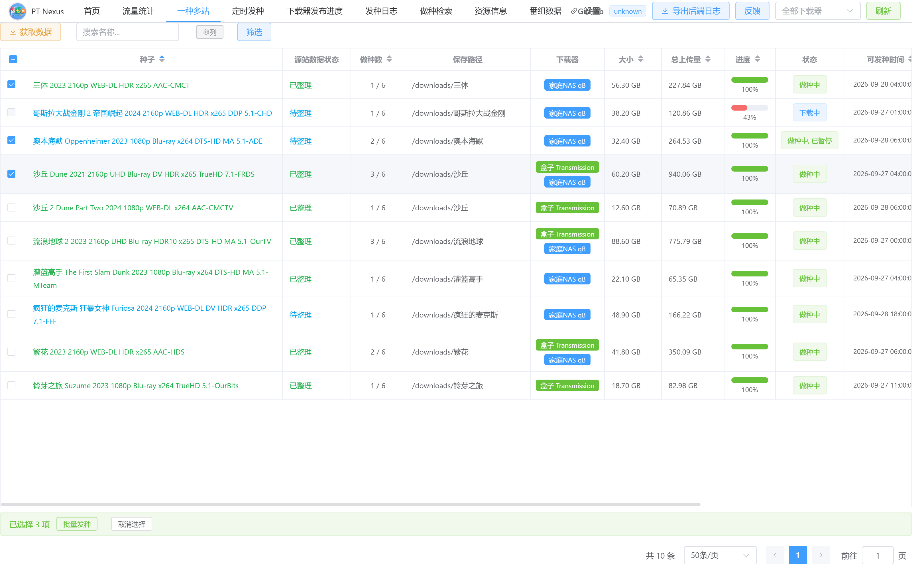

点「批量发种」后选择目标站点（可搜索站点名），再点 `发种到 xxx` 提交；未选择站点时按钮为不可点状态。

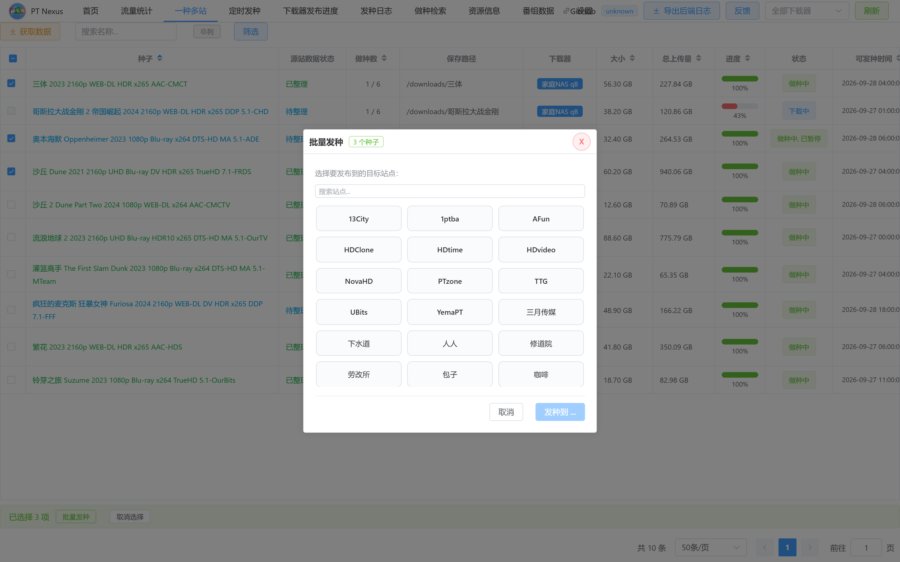

### 4.8 删除

点行内「删除」会询问删除方式：

- `删除记录和文件`：删除本系统记录的全部下载器任务与文件；
- `只删除记录`：仅移除本系统的记录。

> 若下载器在设置中开启了「删除前核对副本」，选择删除文件时未同步入库的副本也会一并删除，请谨慎操作。

---

## 5. 定时发种

**页面作用**：按设定间隔，把一批种子逐个（或逐个站点）自动发布出去。

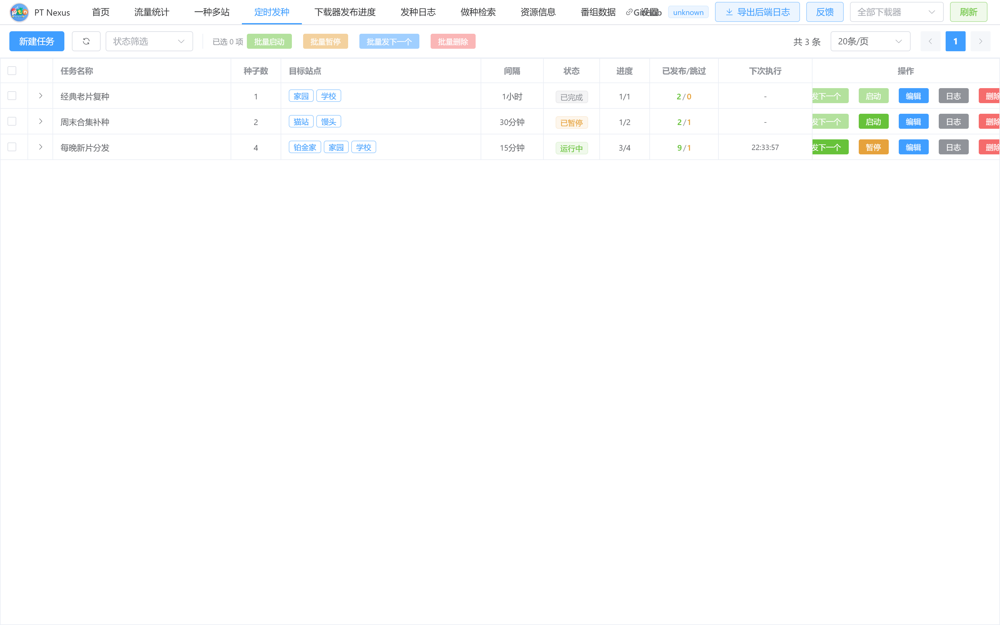

### 5.1 工具栏

- `新建任务`：创建定时发种任务。
- 刷新按钮：刷新任务列表。
- 状态筛选：`全部` / `运行中` / `已暂停` / `已完成`。
- 批量操作：勾选任务后出现 `批量启动`、`批量暂停`、`批量发下一个`、`批量删除`。

### 5.2 表格列

任务名称、种子数、目标站点、间隔、状态、进度（`当前/总数`）、已发布/跳过、下次执行、操作。

展开行可看到任务 ID、触发标签、是否循环发种、创建时间、更新时间、上次执行。

### 5.3 行内操作

| 按钮      | 作用                       |
| ------- | ------------------------ |
| 发下一个    | 跳过等待，立即发布当前进度指向的下一个种子/站点 |
| 暂停 / 启动 | 暂停或恢复任务                  |
| 编辑      | 修改任务配置                   |
| 日志      | 打开该任务的发布日志抽屉             |
| 删除      | 删除任务（不可恢复）               |

### 5.4 新建任务

点「新建任务」打开表单：

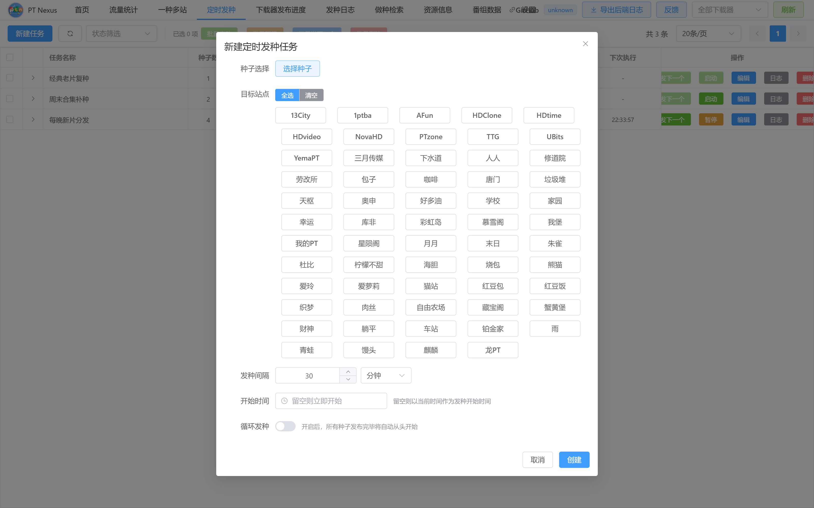

| 表单项  | 说明                    |
| ---- | --------------------- |
| 任务名称 | 任务标识                  |
| 种子选择 | 点「选择种子」从库中挑选参与定时发种的种子 |
| 目标站点 | 勾选要发布到的站点，可「全选」/「清空」  |
| 发种间隔 | 数值 + 单位（分钟 / 小时）      |
| 开始时间 | 留空则立即开始               |
| 循环发种 | 开启后所有种子发完自动从头开始       |

点「选择种子」会打开种子选择弹窗：

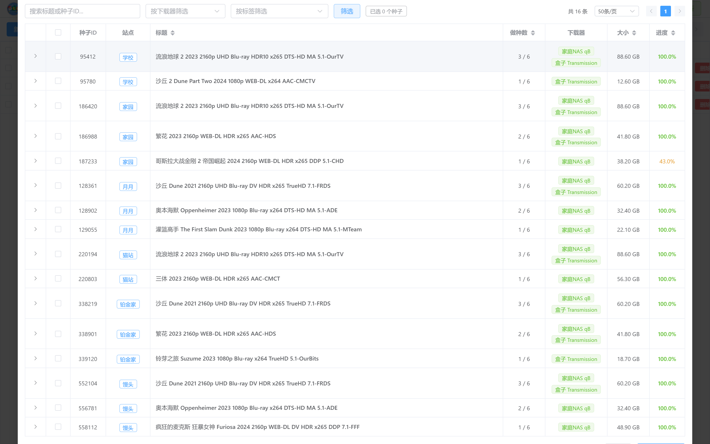

可按标题/种子 ID 搜索，按下载器或标签筛选，展开行可查看「已发布到以下站点」，勾选后点「确认选择 (N)」。

### 5.5 发布日志

点任务行的「日志」打开发布日志抽屉，按时间列出该任务每一次发布的种子标题、源站、目标站、状态与失败原因：

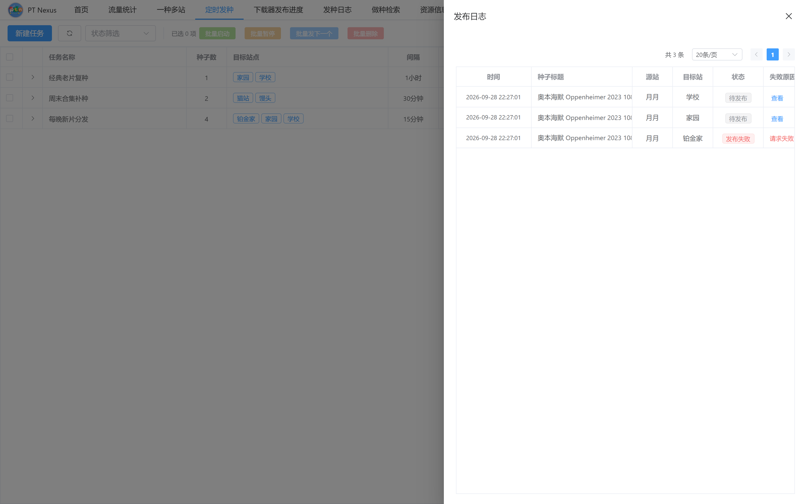

> 统计口径：「已发布」计数在种子入队成功时 +1；若最终被判定为跳过（站点已存在、预检查限制、下载器门禁、4xx 不可重试、重试超限等），系统会把它改判为「跳过」。

---

## 6. 下载器发布进度

**页面作用**：查看发布队列任务的执行情况，必要时手动加速或取消。

### 6.1 状态概览与全局操作

- 顶部状态概览（可点击筛选）：`全部`、`待发布`、`发布中`、`已发布`、`发布失败`、`已取消`。
- **发布下一波**：跳过等待时间，把「计划时间最早且还没到点」的那一波待发布任务立刻发出（范围＝顶部所选下载器）。等待预检查或可发种时间的任务不在此列。
- 自动刷新：可开关，间隔可选 `3 秒` / `5 秒` / `10 秒` / `30 秒`。
- `刷新`：手动刷新列表。

### 6.2 筛选

搜索框（标题/副标题/种子 ID/站点）、发布状态多选、场景（`一种多站` / `一站多种`）、目标站点、队列分组 ID，以及 `查询` / `清空`。

### 6.3 表格列与行内操作

- **种子**：名称、标题、`源站 → 目标站 · 种子ID`。
- **加入队列**：任务进入队列的时间。
- **预计发布时间**：任务真正可执行的时间（计划时间与下次可运行时间取较晚者，填了发布节奏的任务会按波次错开）。
- **发布状态**：`待发布` / `发布中` / `已发布` / `发布失败` / `已取消`。
- **实际发布时间**：真正开始发布的时间，第二行为结束时间；重试会重新计时。
- **重试**：失败任务的尝试次数。
- **操作**：
  - `立即发布`：跳过等待，立刻发布这一条任务（只影响此站点）。
  - `日志`：跳转到「发种日志」页并按该任务过滤。
  - `取消`：取消该站点任务，批次内其他站点不受影响。

> `待发布` 中有一类是"立即发布"任务（已登记进度、由实时发布流程按波次执行，不在队列调度器里），鼠标悬停会有说明，同样支持单站立即发布或取消。

---

## 7. 发种日志

**页面作用**：查询每一次发种动作的结果与详细日志。

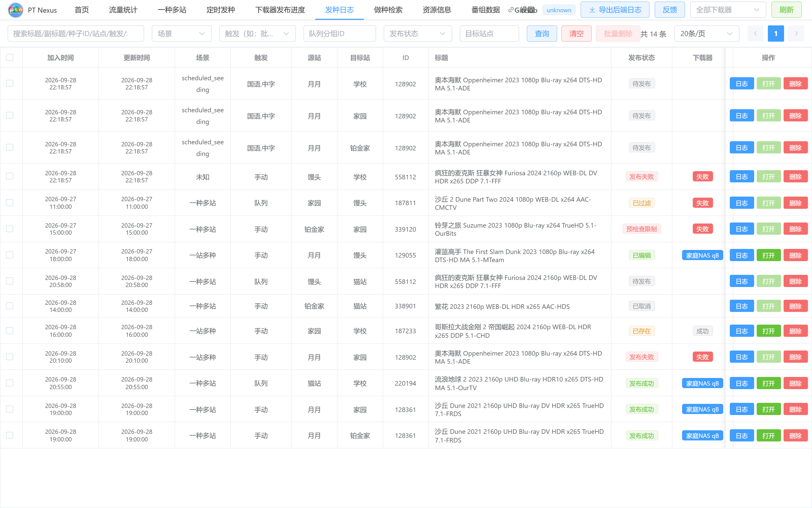

### 7.1 筛选

- 搜索框：`搜索标题/副标题/种子ID/站点/触发/场景...`
- 场景：`一种多站` / `一站多种`
- 触发：可输入 `手动`（manual）/ `队列`（queue）
- 队列分组 ID
- 发布状态：`待发布`、`发布成功`、`发布失败`、`已过滤`、`已存在`、`已编辑`、`已取消`、`已作废`、`预检查限制`
- 目标站点
- `查询` / `清空` / `批量删除 (N)`

筛选条件会自动保存，下次进入页面仍生效。

### 7.2 表格列

加入时间、更新时间、场景、触发、源站、目标站、ID、标题、发布状态、下载器、操作。

**下载器列**含义：`等待发布`（尚未执行）、`未执行`、下载器名称（已添加到下载器）、`失败`。

### 7.3 行内操作

- **日志**：查看该次发布的完整日志，日志末尾会附带 `--- [下载器] ---` 段，说明下载器写入结果。

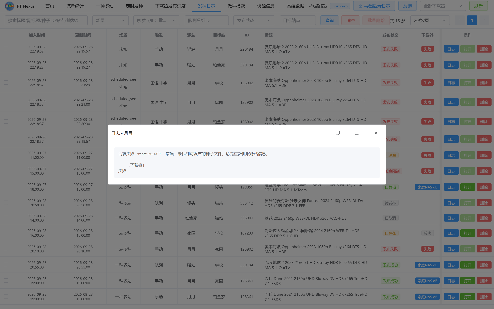

- **打开**：在浏览器打开目标站点的种子页面（仅发布成功时可用）。
- **删除**：删除该条日志；若该日志关联未执行的队列任务，会同时取消该队列任务。

---

## 8. 做种检索

页面分三块：做种站点统计、做种官组统计、本地文件扫描。

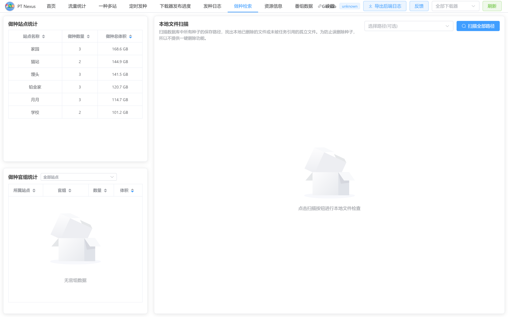

### 8.1 做种站点统计

按站点汇总做种数量与做种总体积，两列均可排序。

### 8.2 做种官组统计

按官组汇总数量与体积，可用右上角站点下拉框筛选「全部站点」或指定站点。

### 8.3 本地文件扫描

扫描数据库中所有种子的保存路径，找出**本地已删除的文件**或**未被任务引用的孤立文件**。

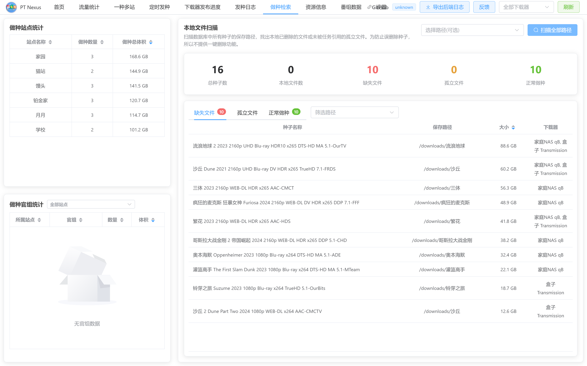

- 路径下拉框可选择「扫描选定路径」或「扫描全部路径」。
- 统计项：总种子数、本地文件数、缺失文件、孤立文件、正常做种。
- 结果分三个页签：`缺失文件`、`孤立文件`、`正常做种`（带数量徽标），右上可按路径再筛选。

> 为防止误删，本功能只做检测、不提供一键删除，请自行确认后再处理。

---

## 9. 资源信息

**页面作用**：维护影片资源信息库（海报、年份、外链 ID、简介、截图），转种时可自动匹配填充。

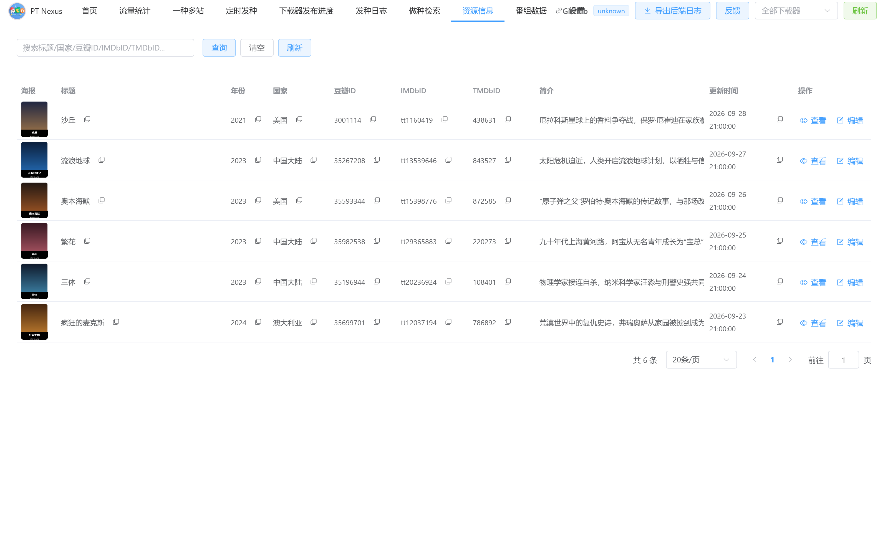

### 9.1 查询

搜索框支持按标题、国家、豆瓣 ID、IMDb ID、TMDb ID 查询；`查询` / `清空` / `刷新`。

### 9.2 表格与操作

列为：海报（缩略图，可点击预览）、标题、年份、国家、豆瓣ID、IMDbID、TMDbID、简介、更新时间、操作（`查看` / `编辑`）。除海报与操作列外，每列右侧都有复制按钮，点击即复制该单元格内容（提示「xxx 已复制」）。

### 9.3 查看详情

点「查看」打开详情弹窗：

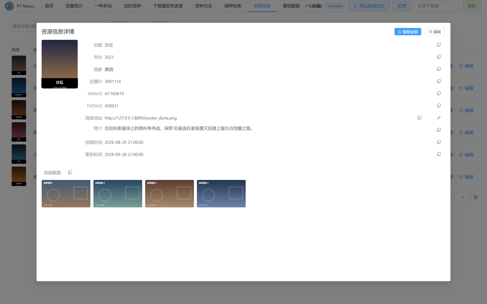

- 顶部 `复制全部` 可把全部字段拼成多行文本复制；`编辑` 直接进入编辑。
- 海报地址可点「跳转打开」；底部为视频截图图廊。

### 9.4 编辑

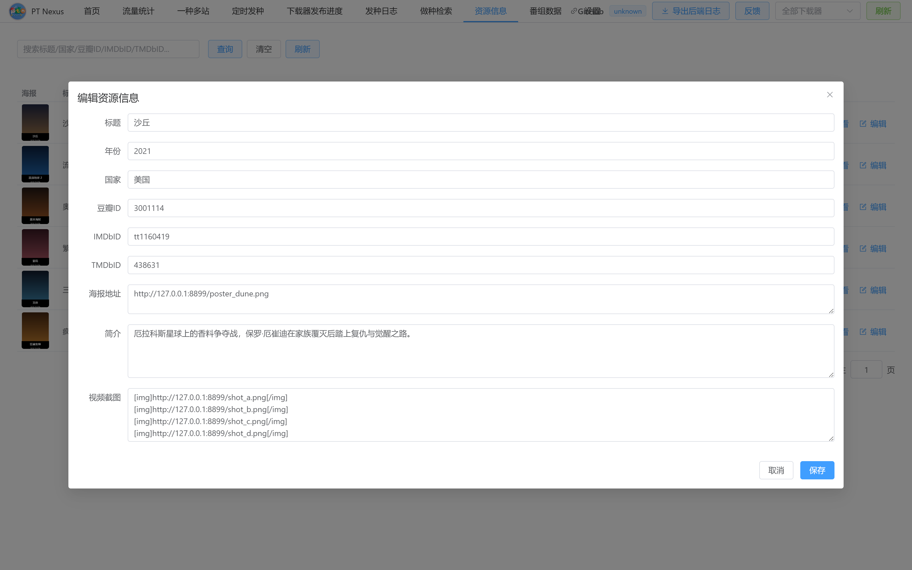

可编辑标题、年份、国家、豆瓣ID、IMDbID、TMDbID、海报地址、简介、视频截图。海报地址与视频截图都支持 `[img]url[/img]` 写法，多个截图连续书写即可。点「保存」提交。

---

## 10. 番组数据

**页面作用**：同步并查询 Bangumi 番组条目，用于动画类种子的中文名、播出信息与外链识别。

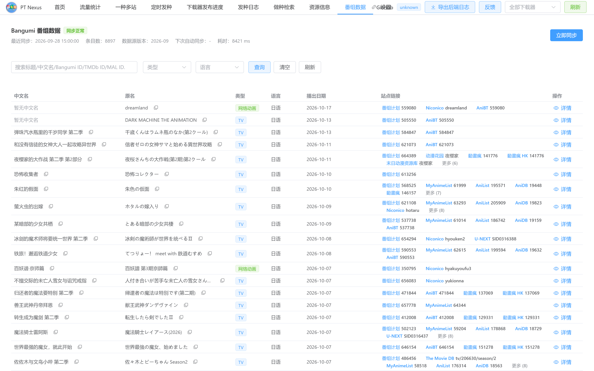

### 10.1 同步面板

顶部显示状态标签（`同步正常` / `同步中` / `同步失败` / `尚未同步`）与最近同步时间、条目数、数据源版本、下次自动同步、耗时；点 `立即同步` 可手动触发。

> 系统每 24 小时自动同步一次。同步进行中重复点击会提示「同步正在进行中，请稍后再试」。

### 10.2 查询

搜索框（标题/中文名/Bangumi ID/TMDb ID/MAL ID…）、类型筛选（`全部类型` / `TV` / `剧场版` / `OVA` / `网络动画`）、语言筛选（`全部语言` / `日语` / `简体中文` / `英语`）。

### 10.3 表格与详情

列为：中文名（无则显示「暂无中文名」）、原名、类型、语言、播出日期、站点链接（主站链接 + 「更多 (N)」浮层）、操作（`详情`）。

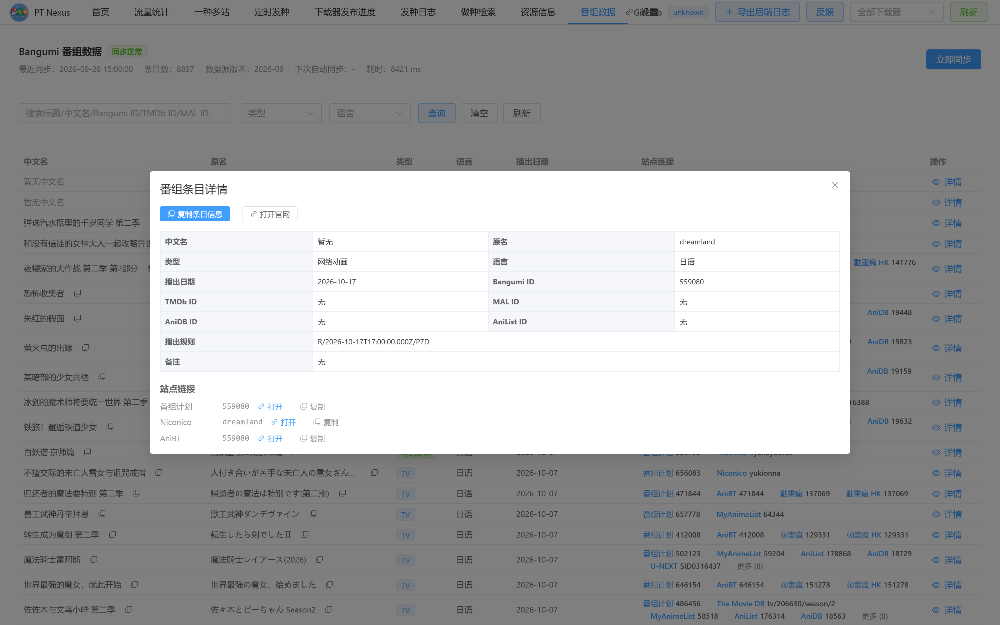

详情弹窗显示中文名、原名、类型、语言、播出日期、Bangumi/TMDb/MAL/AniDB/AniList ID、播出规则、备注、「其他译名」与「站点链接」（每条可打开或复制），顶部支持 `复制条目信息` 与 `打开官网`。

---

## 11. 设置

设置页左侧有三个入口：`设置`（基础）、`下载器`、`站点管理`。

### 11.1 基础设置

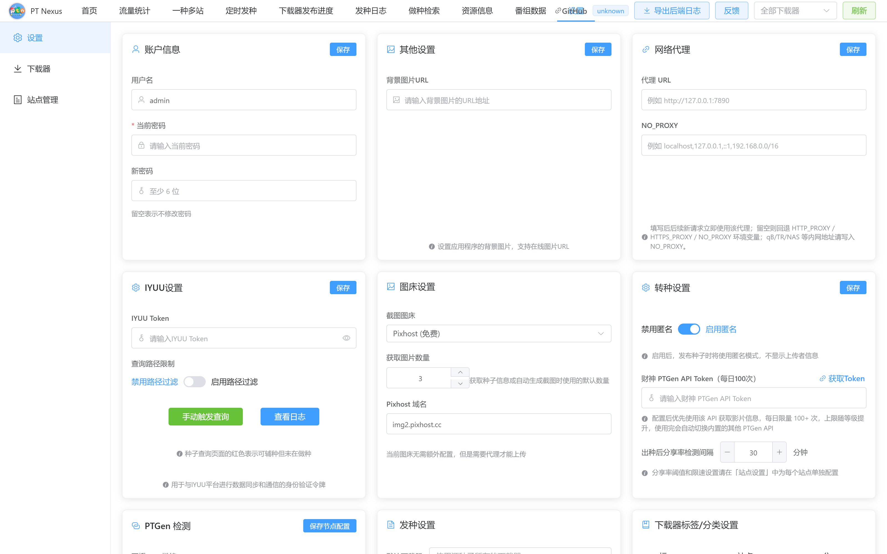

**账户信息**

- 修改「用户名」「新密码」时需填写「当前密码」。
- 新密码留空表示不修改密码；若当前是临时密码，标签会显示「临时密码-请立即修改」。
- 点该区域右上角 `保存` 提交。

**其他设置**

- `背景图片URL`：设置应用背景图（支持在线图片 URL）。
- 桌面版还可点 `打开数据库配置文件`（修改后需重启应用）。

**网络代理**

- `代理 URL`（如 `http://127.0.0.1:7890`）与 `NO_PROXY`（如 `localhost,127.0.0.1,::1,192.168.0.0/16`）。
- 填写后新请求立即使用该代理；留空则回退到环境变量 `HTTP_PROXY` / `HTTPS_PROXY` / `NO_PROXY`。qB / TR / NAS 等内网地址请务必写入 NO_PROXY。

**IYUU 设置**

- 填写 `IYUU Token` 后可点「手动触发查询」批量补齐种子详情链接，点「查看日志」查看查询记录。
- 「查询路径限制」可启用/禁用路径过滤，并选择参与查询的路径。
- 提示：**种子查询页面的红色表示可辅种但未在做种。**

**图床设置**
- `截图图床`（如 Pixhost）、`获取图片数量`（1–10，抓取种子信息或自动生成截图时的默认数量）、`Pixhost 域名`；末日图床需填邮箱与密码。
- 部分图床无需额外配置但需要代理才能上传。

**转种设置**
- `启用匿名`：发布种子时使用匿名模式，不显示上传者信息。
- `财神 PTGen API Token`：配置后优先使用该接口获取影片信息（每日限量，用尽后自动切换到内置的其他 PTGen API）。
- `出种后分享率检测间隔`（分钟）：分享率阈值与限速请在「站点管理」中按站点单独配置。

**PTGen 检测**
- 填入豆瓣 ID 或链接后点「开始检测」，会对每个节点发起真实请求，列出节点、状态、开关、HTTP 码、耗时与详情。
- 下方「节点优先级与开关（顺序即请求优先级，靠前优先）」可上移/下移节点、启用或停用，改完点「保存节点配置」。

**发种设置**
- `默认下载器`：发种完成后自动把种子添加到指定下载器；选择「使用源种子所在的下载器」或不选择时，添加到源种子所在下载器。
- `目标站点已存在时是否添加到下载器`。
- `批量发布并发策略`：`自动（CPU线程数×2）` / `所有站点同时发布` / `手动设置并发数`。
  > 若某台下载器在「设置 → 下载器」里配置了发布节奏（分钟间隔 > 0），由该下载器发起的「一种多站」转种会按下载器的节奏与并发执行，此处策略对它不生效。

**下载器标签 / 分类设置**

- 开关：`标签`、`站点名`、`分类`。
- 开启「站点名」后会为种子添加 `站点/{站点名称}` 标签。
- `自定义标签`（输入后点「添加标签」）和 `自定义分类`。

### 11.2 下载器

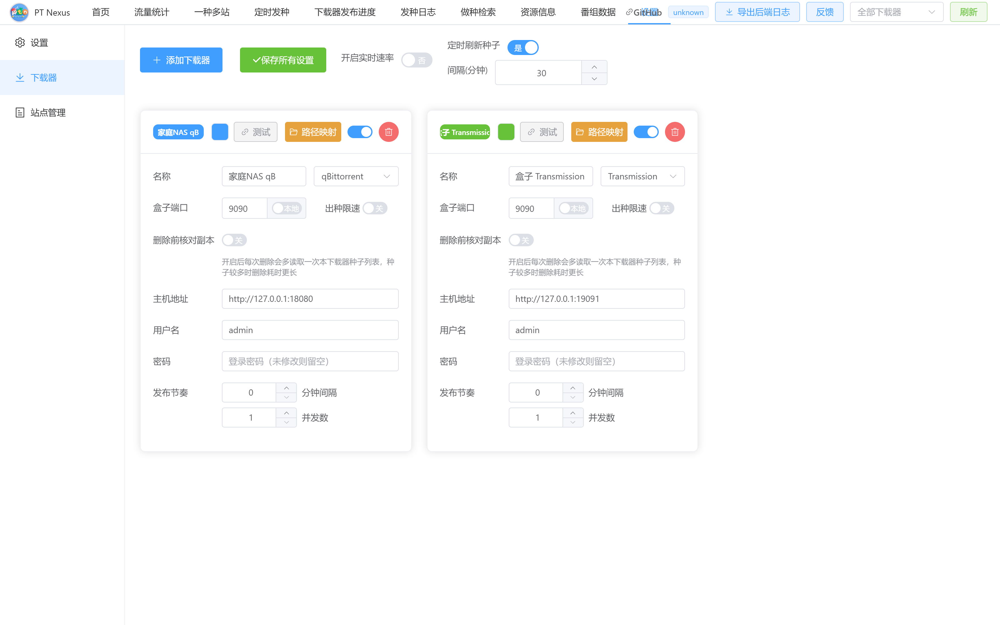

**顶部操作**
- `添加下载器`、`保存所有设置`。
- `开启实时速率`：开启后图表页每秒取一次数据以显示「近1分钟」实时速率（关闭后每分钟一次，降低负载）。
- `定时刷新种子` + `间隔(分钟)`：开启后按间隔自动从下载器同步种子状态。

**单个下载器卡片**：名称、颜色、`测试`、`路径映射`、启用开关、删除按钮。

| 表单项 | 说明 |
| --- | --- |
| 名称 | 如「家庭服务器 qB」 |
| 类型 | `qBittorrent` / `Transmission` |
| 盒子端口 | 远程/本地盒子代理端口（创建种时用） |
| 出种限速 | 开启后参与基于站点分享率阈值的出种限速 |
| 删除前核对副本 | 删除时多读一次下载器种子列表核对，种子多时删除更慢 |
| 主机地址 | 下载器 WebUI 地址 |
| 用户名 / 密码 | 登录凭据（密码未修改则留空） |
| 发布节奏 | `分钟间隔`（同一种子发往多个目标站时每隔多少分钟发一波，0 表示不间隔）+ `并发数`（每波同时处理的目标站数量） |

> 发布节奏示例：3 个目标站、并发 2、间隔 5 分钟 → 前 2 个站先发，第 3 个站 5 分钟后发。填了分钟间隔后，该下载器发起的「一种多站」转种会按此并发分波，并覆盖基础设置里的批量发布并发策略。

**路径映射**：点「路径映射」配置下载器路径 → PT Nexus 容器内路径的映射，用于把下载器里的保存路径换算成系统可访问的路径；点「添加映射规则」可增加多行。

### 11.3 站点管理

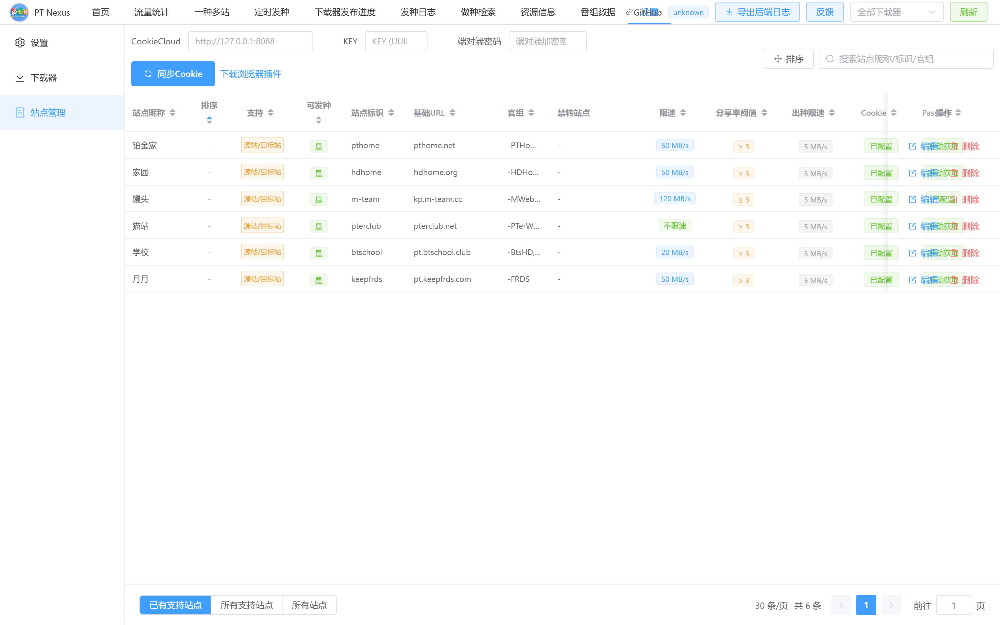

**顶部操作**
- `CookieCloud`：填 URL、KEY、端对端密码后点「同步Cookie」，可批量同步站点 Cookie；也可点「下载浏览器插件」。
- `排序` / `保存排序` / `取消`：进入排序模式后可拖拽调整站点顺序。
- 搜索框：按站点昵称/标识/官组过滤。
- 底部筛选：`已有支持站点` / `所有支持站点` / `所有站点`。

**表格列**：站点昵称、排序、支持（`源站/目标站` / `源站` / `目标站`）、可发种、站点标识、基础URL、官组、禁转站点、限速、分享率阈值、出种限速、Cookie（`已配置` / `未配置` / `无需配置`）、Passkey（`已配置` / `未配置` / `自动获取`）、操作。

**编辑站点**：点行内「编辑」打开：

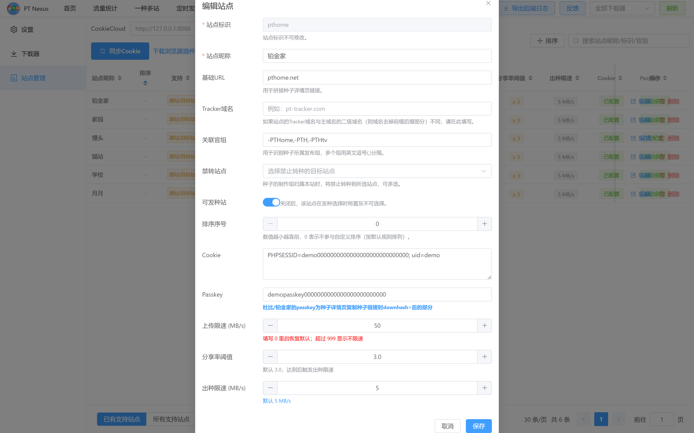

| 字段 | 说明 |
| --- | --- |
| 站点标识 | 不可修改 |
| 站点昵称 | 系统中显示的名称 |
| 基础URL | 用于拼接种子详情页链接 |
| Tracker域名 | Tracker 域名与主域名不同二级域名时填写 |
| 关联官组 | 用于识别种子所属发布组，多个用英文逗号分隔 |
| 禁转站点 | 种子制作组归属本站时禁止转往的站点，可多选 |
| 可发种站 | 关闭后该站点在发种选择时置灰不可选 |
| 排序序号 | 数值越小越靠前，0 表示不参与自定义排序 |
| Cookie | 源站抓取必需，从浏览器获取 |
| Passkey | 部分站点需按提示获取（如杜比/铂金家为种子链接 `downhash=` 之后的部分） |
| 上传限速 (MB/s) | 0 表示重启恢复默认；超过 999 显示不限速 |
| 分享率阈值 | 默认 3.0，达到后触发出种限速 |
| 出种限速 (MB/s) | 默认 5 |

> 要让站点出现在「可发种目标站」列表，需要它是目标站（或源站+目标站）且「可发种站」为开启；要作为源站抓取信息，必须配置 Cookie 或 Passkey。

---

## 12. 常见问题

**Q：首页下载器显示「连接失败」怎么办？**
检查「设置 → 下载器」中的主机地址、端口、用户名密码，点卡片上的「测试」。若下载器在另一台机器，确认网络可达且 WebUI 已开启远程访问。

**Q：页面列表是空的？**
先确认顶部「全局下载器」是否为「全部下载器」；再到「一种多站」点「获取数据」从下载器同步一次。

**Q：转种时「下一步：发布参数预览」按钮点不动？**
按钮下方会给出具体原因，按提示修正即可。常见原因：存在「无法识别」的内容需要手动删除、年份为空、海报/截图/简介为空、简介缺少片名/产地/简介标记、类型/媒介/编码/分辨率/制作组为空、MediaInfo 格式无效。

**Q：为什么发到某个站点的种子被跳过了？**
到「发种日志」查看该条记录的状态与日志：`已存在` 表示目标站已有该种子；`预检查限制` 表示命中禁转/受限标签/下载器门禁等规则；`已过滤` 表示被过滤规则跳过。

**Q：同时发多个站点会一起发出去吗？**
取决于下载器的「发布节奏」：`分钟间隔` 为 0 时一次性发出；大于 0 时按「并发数」分波错峰。等待期间可以在「下载器发布进度」点「发布下一波」跳过等待。
